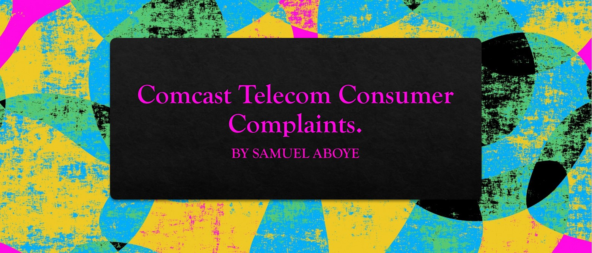

### <h1 align="center" style="color:blue;" id="heading">EDA on</h1>
### <h1 align="center" style="color:blue;" id="heading">Comcast Telecom Consumer Complaints</h1>
### <h1 align="center" style="color:blue;" id="heading">Complaints.</h1>
<!-- PROJECT LOGO -->
 

  

  

### Table of contents
1. [About The Project](#About_The_Project)
2. [Objective](#objective)
3. [Data Dictionary](#Data_Dictionar_)
4. [Number of complaints per Month](#Number_of_complaints_Per_Month)
5. [Number of complaints per Day](#Number_of_Complaints)
6. [Calendar Chart](#Calendar_Chart)
7. [Complaint Types.](#Complaint_Types)
8. [Number of issue Per Case](#Number_of_issue_Per_Case)
9. [Topic Model](#Topic_Model)
10. [Total Number of Tickets per states](#Total_Number_of_Tickets_per_states)
11. [Open and Closed Tickets per States](#Open_and_Closed_Tickets_per_States)
12. [Summary](#Summary)
12. [Author](#author)
13. [Contributing](#contributing)
14. [Support](#support)
15. [License](#license)
16. [Acknowledgements](#Acknowledgements)

***

#### About The Project 

Comcast is an American global telecommunication company. The firm has been providing terrible customer service. They continue to fall short despite repeated promises to improve. Only last month (October 2016) the authority fined them a $2.3 million, after receiving over 1000 consumer complaints.

### Objective:-
A project is to make a simple Exploratory Data Analysis to find an insight Comcast is an American global telecommunication company. 

### Data Dictionary 
The existing [database](https://www.kaggle.com/vik2012kvs/comcast-telecom-consumer-complaints) will serve as a repository of public customer complaints filed against Comcast.
- Ticket #: Ticket number assigned to each complaint
- Customer Complaint: Description of complaint
- Date: Date of complaint
- Time: Time of complaint
- Received Via: Mode of communication of the complaint
- City: Customer city
- State: Customer state
- Zipcode: Customer zip
- Status: Status of complaint
- Filing on behalf of someone

***
### Number of complaints per monthly 
A trend chart for the number of complaints at monthly  granularity levels.

***
### Number_of_Complaints    
A trend chart for the number of complaints at  daily granularity levels.

***
### Calendar Chart 

***
  
#### Complaint Types.

The most complaint types like around internet, network issues, or across any other domains.

  
***
  
  
 ### Number of issue Per Case  

  
***
  
### Topic Model 
 Topic modeling to find the most frequently discussed issues in the customer complaints.

  
***
  
### Total Number of Tickets per states  

  
***
  
### Open and Closed Tickets per States 

 ***
### Open and Closed Tickets  

 ***
  
<!--Summary -->  
## Summary  
- There was total of 2224 Tickets from which 77% are closed and there are still 23%  open tickets. 

- The highest ticket was recorded in July 2015,  generally there was a high ticket recorded form April to July. 

- Most of the issue are related to Internet Speed, Data, Service and Billings.

- Georgia has high number of ticket and Iowa has very Low ticket. 
  
***
  
<!-- Contributing -->  
#### Author  
  
***
👤 **SABOYE**

* Twitter: [@saboye1](https://twitter.com/saboye1 )
* Github: [@saboye](https://github.com/saboye)
  
***
<!-- Contributing -->
#### 🤝 Contributing  

Contributions, issues and feature requests are welcome! Feel free to check [issues page](https://github.com/saboye/Comcast-Telecom-Consumer-Complaints/issues).
  
***
<!-- support -->
#### Show your support  
Give a ⭐️ if this project helped you!
  
***
<!-- License -->
#### 📝 License  

Copyright © 2021 [saboye](https://github.com/saboye). 
This project is [MIT](https://github.com/saboye/Comcast-Telecom-Consumer-Complaints/blob/master/LICENSE) licensed.
  
***  
<!-- ACKNOWLEDGEMENTS -->
### Acknowledgements 
  
* [https://www.kaggle.com](https://www.kaggle.com/vik2012kvs/comcast-telecom-consumer-complaints)

***
